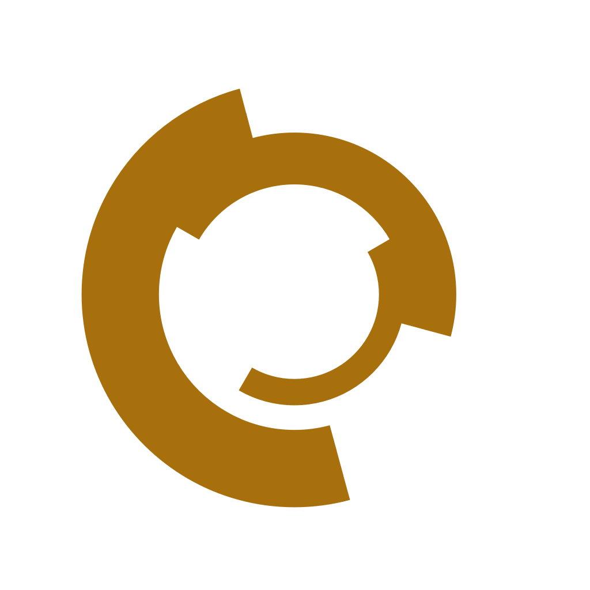

> [!NOTE]
> Shamelessly made with A.I.

# Combine Logo Studio

An interactive editor for building **Combine "City" logos** in the style of Half-Life 2 —
the broken ring / coil emblem plastered on Combine propaganda all over City 17.

It is made primarily for **HL2 map makers** who want a custom logo for their own city
(City 8, City 24, City 45, ...) that follows the canonical construction, exported as a
clean transparent PNG or SVG that can then be converted into a VTF/VMT overlay or
decal texture for Hammer.

| City 17 (Half-Life 2) | City 10 (Entropy : Zero) |
| :---: | :---: |
|  |  |

## How the logo works

The canonical logo is a grid: **N equal-angle wedges × M concentric ring bands**.
Every cell in that grid is independently filled or cut. The number of filled bands in
each wedge encodes a digit, and the **sum of all filled cells across the logo equals
the city number** — the City 17 logo is 2 + 3 + 1 + 4 + 3 + 4 = **17**.

So to design a logo for your own city: pick your wedge count, then distribute cuts so
the total lands on your city number. The live per-wedge counters and the sum readout
in the editor do the bookkeeping for you.

## Built-in presets

- **City 17** — the canonical Half-Life 2 logo (6 wedges × 5 rings, sums to 17).
  Loaded by default on startup.
- **City 10** — the Entropy : Zero city logo (7 wedges × 4 rings).
  > **Note:** surprisingly, the City 10 logo does **not** add up to 10 — its wedge
  > counts (2 + 3 + 1 + 1 + 1 + 2 + 2) sum to **12**. The preset stays that way on
  > purpose: it matches the exact dimensions of the actual Entropy : Zero logo, and
  > fidelity to the source material beats making the math work out.

Both presets are also available as loadable project files in [`presets/`](presets/).

## Requirements

- Python 3.9+
- PySide6 (`pip install PySide6`)

## Run

```
python combine_logo_studio.py
```

## Controls

- **Left-click a cell** — toggle it filled / cut (gap)
- **Right-click a cell** — pick a custom color for just that cell
- **Drag a wedge boundary line** — resize the wedge (hold **Shift** to ignore angle snapping)
- The side panel edits wedge angles, colors, quick-set fill counts, and labels;
  the appearance panel controls ring count, thickness, rotation, gaps, and background.
- **Ctrl+Z / Ctrl+Y** — undo / redo

## Export

- **PNG** (1024×1024, transparent background supported) — ready for VTF conversion
  (e.g. via VTFEdit) into an overlay/decal material.
- **SVG** — for further vector editing.
- **Copy PNG to clipboard** — for quick pasting into an image editor.
- Projects save/load as human-readable JSON, so logos are easy to share and tweak.
